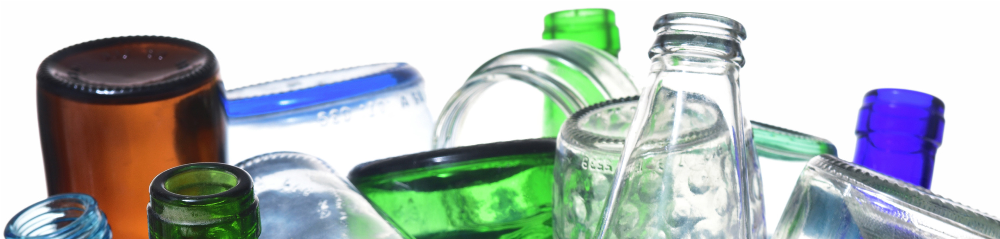

# Plastic or Glass? - Image Classication with Deep Learning
###### METIS Data Science and Machine Learning Bootcamp 2022 by Krystian Krystkowiak
###### project/month(6/7) focus: DEEP LEARNING
#### Code - [GitHub](https://github.com/Krystkowiakk/Argentinian-Tango-Lyrics-Sentiment-Topics-NLP/blob/main/1.%20Krystkowiak_Krystian_Project_5_Argentinian%20Tango%20Lyrics%20Sentiment%20%26%20Topics%20NLP%20-%20cleaning.ipynb)
#### Presentation [GitHub](https://github.com/Krystkowiakk/Argentinian-Tango-Lyrics-Sentiment-Topics-NLP/blob/main/Project%20Presentation/Krystkowiak_Krystian_Project_5_Argentinian%20Tango%20Lyrics%20Sentiment%20%26%20Topics%20NLP.pdf)

ABSTRACT

- Developed a deep learning model to classify glass and plastic waste photos (Kaggle
competition dataset) using Tensor Flow and Keras, testing various models including Neural Networks, Convolutional Neural Networks, and Transfer learning with pre-trained models such as VGG16, VGG19, and Xception. Achieved a high F1 score of 90% with the CNN model.
- This project aims to build a deep learning model that can classify glass and plastic waste photos. The goal is to achieve an acceptable F1 score and potentially integrate the model into more complex systems for use in modern sorting technologies. The dataset used for this project is "Images dataset for classifying household garbage" from Kaggle. The project begins with a logistic regression baseline model, then training, testing, and fine-tunning of different deep learning models. The best performing model, a refined Convolutional Neural Network (CNN), is then visualized and proposed as the final solution. The project uses Keynote and Tableau for visualization and presentation.

DESIGN

The project addresses the challenge of efficient waste management by building and improving a machine learning model that can classify different types of waste. Specifically, it focuses on classifying glass and plastic waste, as these materials present more complex classification problems. 

With over 2 billion tons of garbage generated globally every year, mismanagement of waste leads to environmental pollution and human health issues. Innovations such as smart waste containers and self-learning sorting technologies can help to mitigate these problems. Building and improving a machine learning model for waste classification is one step towards creating these solutions.

DATA

The dataset used for this project is part of "Images dataset for classifying household garbage" from Kaggle, created by Mostafa Mohamed. The dataset is available at this link: https://www.kaggle.com/datasets/mostafaabla/garbage-classification and is a mixture of older Kaggle "Garbage Classification" datasets and web scraped images.

It contains 2876 RGB images, belonging to 4 classes: plastic (865 images), green-glass (629 images), brown-glass (607 images) and white-glass (775 images). 

ALGORITHMS

- This project uses various algorithms for data cleaning, loading, preprocessing, and model building. The F1 score is used as the metric to evaluate the models. The data is split into 80% (2300 images) for training and 20% (576 images) for validation. The project includes fine-tuning the models, designing layers, using different optimizers, and implementing regularization techniques.

The following models were trained and tested:

- Logistic Regression (baseline model): F1 on training set: 0.470, F1 on validation set: 0.459
- Neural Network model: F1 on training set: 0.960, F1 on validation set: 0.803
- Convolutional Neural Network (best F1 and with smallest overfitting): F1 on training set: 0.945, F1 on validation set: 0.898
- Transfer learning - VGG16 (second "best"): F1 on training set: 0.997, F1 on validation set: 0.861
- Transfer learning - VGG19: F1 on training set: 0.990, F1 on validation set: 0.848
- Transfer learning - Xception: F1 on training set: 0.999, F1 on validation set: 0.792
- Transfer learning - VGG19 (how is it trained matters): F1 on training set: 0.213, F1 on validation set: 0.310

The final model chosen for this project was the convolutional neural network (CNN) as it had the best F1 score and the smallest overfitting among the models tried.

TOOLS

- Python, Pandas, and Numpy for data processing
- Scikit-learn, Keras, Tensorflow for modeling (Logistic Regression, Neural Network model, Convolutional Neural Network (CNN), Transfer learning using various pre-trained models: VGG16, VGG19, and Xception)
- Google Colab to test some of the models
- Seaborn and Tableau for visualization

COMMUNICATION

The final results of the project are presented in a 5-minute recorded video that includes visualizations to communicate the findings and the best performing model.

